# Common Core Standards Visual Representation

This document provides a visual representation of the Common Core State Standards (CCSS) framework used in this lesson plan generator.

## Standards Structure

```mermaid
graph TB
    CCSS[Common Core State Standards] --> ELA[English Language Arts]
    CCSS --> Math[Mathematics]
    
    ELA --> Reading[Reading]
    Reading --> RL[Reading Literature]
    Reading --> RI[Reading Informational]
    Reading --> RF[Reading Foundations]
    
    ELA --> Writing[Writing]
    Writing --> W1[Text Types]
    Writing --> W2[Production/Distribution]
    Writing --> W3[Research]
    
    ELA --> SL[Speaking & Listening]
    SL --> SL1[Comprehension/Collaboration]
    SL --> SL2[Presentation]
    
    ELA --> L[Language]
    L --> L1[Conventions]
    L --> L2[Knowledge of Language]
    L --> L3[Vocabulary]

    Math --> Practices[Mathematical Practices]
    Practices --> MP1[Problem Solving]
    Practices --> MP2[Reasoning]
    Practices --> MP3[Construction/Critique]
    Practices --> MP4[Modeling]
    
    Math --> Domains[Math Domains]
    Domains --> CC[Counting & Cardinality]
    Domains --> OA[Operations & Algebraic]
    Domains --> NBT[Numbers & Base Ten]
    Domains --> NF[Numbers & Fractions]
    Domains --> MD[Measurement & Data]
    Domains --> G[Geometry]
    
    CCSS --> GradeLevels[Grade Levels]
    GradeLevels --> K[Kindergarten]
    GradeLevels --> G1_5[Grades 1-5]
    GradeLevels --> G6_8[Grades 6-8]
    GradeLevels --> G9_12[Grades 9-12]
```

## Standards Implementation Details

### English Language Arts (ELA)

#### Reading
- **Literature**: Analysis of fiction, drama, and poetry
- **Informational Text**: Analysis of non-fiction texts
- **Reading Foundations**: Print concepts, phonics, and fluency (K-5)

#### Writing
- **Text Types and Purposes**: Arguments, informative/explanatory texts, narratives
- **Production and Distribution**: Planning, revising, editing, technology use
- **Research**: Short and sustained research projects

#### Speaking and Listening
- **Comprehension and Collaboration**: Discussions and presentations
- **Presentation of Knowledge and Ideas**: Strategic use of media and visual displays

#### Language
- **Conventions**: Grammar, usage, mechanics
- **Knowledge of Language**: Style and context variation
- **Vocabulary**: Word meanings, relationships, academic terms

### Mathematics

#### Mathematical Practices
1. **Make sense of problems and persevere in solving them**
2. **Reason abstractly and quantitatively**
3. **Construct viable arguments and critique others' reasoning**
4. **Model with mathematics**
5. **Use appropriate tools strategically**
6. **Attend to precision**
7. **Look for and make use of structure**
8. **Look for and express regularity in repeated reasoning**

#### Mathematical Domains
- **Counting & Cardinality**: Number names and counting sequences (K)
- **Operations & Algebraic Thinking**: Addition, subtraction, multiplication, division
- **Numbers & Operations in Base Ten**: Place value and operations
- **Numbers & Operations - Fractions**: Understanding and operations with fractions
- **Measurement & Data**: Units, time, money, graphs
- **Geometry**: Shapes, area, volume, coordinate plane

### Grade Level Organization
- **Kindergarten**: Foundation skills in both ELA and Mathematics
- **Grades 1-5**: Elementary standards with increasing complexity
- **Grades 6-8**: Middle school standards with advanced concepts
- **Grades 9-12**: High school standards organized by conceptual categories

Each grade level includes grade-specific standards within each domain, ensuring a coherent progression of knowledge and skills as students advance through their education.
