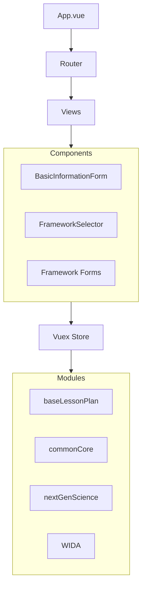
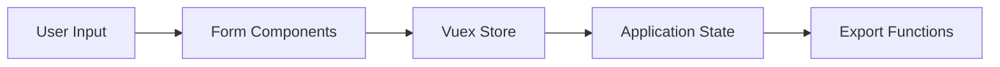
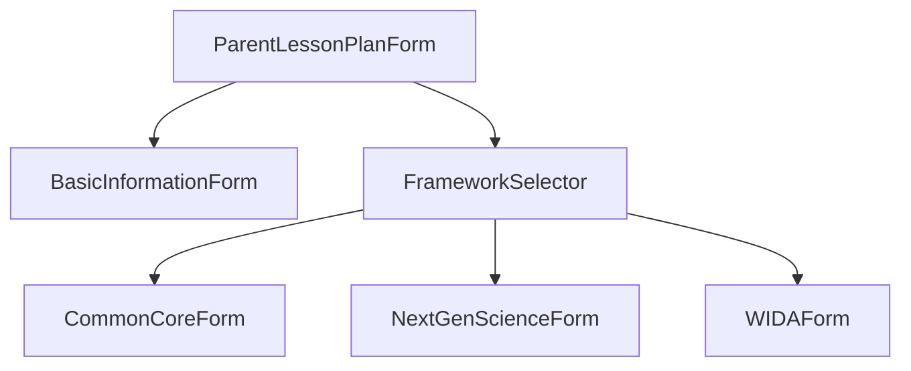
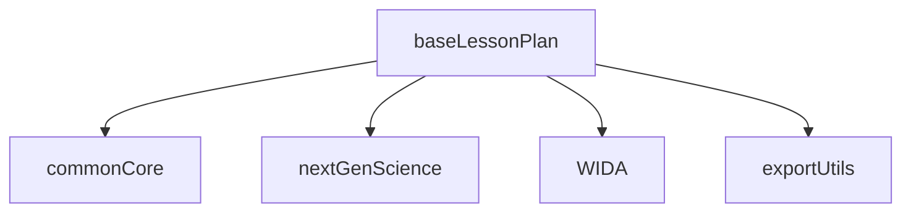

# System Patterns

## Architecture Overview



## Design Patterns

### 1. Component Hierarchy
- **Parent-Child Pattern**
  - ParentLessonPlanForm as container
  - Child components for specific sections
  - Props down, events up communication

### 2. State Management
- **Vuex Store Modules**
  - Separate modules per framework
  - Base lesson plan module for shared state
  - Actions for async operations
  - Getters for computed state

### 3. Form Management
- **Dynamic Form Generation**
  - Framework-specific form components
  - Conditional rendering based on selection
  - Validation rules per framework

### 4. Data Flow


## Key Technical Decisions

### 1. Frontend Framework
- Vue.js with TypeScript for type safety
- Vuetify for UI components
- Vue Router for navigation

### 2. State Management
- Vuex for centralized state
- Modular store design
- Type-safe store modules

### 3. Data Storage
- Local storage for persistence
- JSON format for data structure
- File-based export options

## Component Relationships

### Form Components


### Store Module Integration


## Implementation Guidelines

### 1. Component Structure
- Single responsibility principle
- Reusable form components
- Clear prop interfaces

### 2. State Management
- Actions for API calls
- Mutations for state updates
- Getters for derived data

### 3. Form Validation
- Client-side validation
- Framework-specific rules
- Real-time feedback

### 4. Error Handling
- Consistent error patterns
- User-friendly messages
- Error state management

## Code Organization

### Directory Structure
```
src/
├── components/
│   ├── LessonPlan/
│   └── Frameworks/
├── store/
│   └── modules/
├── views/
├── router/
├── constants/
└── services/
```

### Module Patterns
- Feature-based organization
- Clear separation of concerns
- Consistent naming conventions

## Best Practices

### 1. TypeScript Usage
- Strong typing for props
- Interface definitions
- Type guards where needed

### 2. Component Design
- Composition API
- Props validation
- Event handling patterns

### 3. State Management
- Typed store modules
- Action/mutation naming
- State access patterns

### 4. Testing Strategy
- Unit tests for components
- Store module testing
- Integration testing
