# Next Generation Science Standards Visual Representation

This document provides a visual representation of the Next Generation Science Standards (NGSS) framework used in this lesson plan generator.

## Standards Structure

```mermaid
graph TB
    NGSS[Next Generation Science Standards] --> Dimensions[Three Dimensions]
    NGSS --> GradeBands[Grade Bands]
    
    Dimensions --> Practices[Science & Engineering Practices]
    Practices --> P1[Asking Questions]
    Practices --> P2[Developing Models]
    Practices --> P3[Planning Investigations]
    Practices --> P4[Analyzing Data]
    Practices --> P5[Using Mathematics]
    Practices --> P6[Constructing Explanations]
    Practices --> P7[Engaging in Argument]
    Practices --> P8[Obtaining Information]
    
    Dimensions --> Concepts[Crosscutting Concepts]
    Concepts --> C1[Patterns]
    Concepts --> C2[Cause and Effect]
    Concepts --> C3[Scale & Proportion]
    Concepts --> C4[Systems]
    Concepts --> C5[Energy & Matter]
    Concepts --> C6[Structure & Function]
    Concepts --> C7[Stability & Change]
    
    Dimensions --> CoreIdeas[Disciplinary Core Ideas]
    CoreIdeas --> PS[Physical Sciences]
    CoreIdeas --> LS[Life Sciences]
    CoreIdeas --> ESS[Earth & Space Sciences]
    CoreIdeas --> ETS[Engineering & Technology]
    
    GradeBands --> K2[K-2]
    GradeBands --> G35[3-5]
    GradeBands --> G68[6-8]
    GradeBands --> G912[9-12]
    
    PS --> PS1[Matter & Interactions]
    PS --> PS2[Motion & Stability]
    PS --> PS3[Energy]
    PS --> PS4[Waves]
    
    LS --> LS1[Molecules to Organisms]
    LS --> LS2[Ecosystems]
    LS --> LS3[Heredity]
    LS --> LS4[Evolution]
    
    ESS --> ESS1[Earth's Place]
    ESS --> ESS2[Earth's Systems]
    ESS --> ESS3[Earth & Human Activity]
```

## Standards Implementation Details

### Science and Engineering Practices
1. **Asking Questions and Defining Problems**
   - Scientific questions
   - Engineering problems
   - Investigation planning

2. **Developing and Using Models**
   - Diagrams and physical replicas
   - Mathematical representations
   - Computer simulations

3. **Planning and Carrying Out Investigations**
   - Variables identification
   - Data collection methods
   - Experimental design

4. **Analyzing and Interpreting Data**
   - Data visualization
   - Statistical analysis
   - Pattern recognition

5. **Using Mathematics and Computational Thinking**
   - Quantitative analysis
   - Mathematical modeling
   - Data processing

6. **Constructing Explanations and Designing Solutions**
   - Scientific reasoning
   - Evidence-based conclusions
   - Engineering solutions

7. **Engaging in Argument from Evidence**
   - Scientific discourse
   - Evidence evaluation
   - Logical reasoning

8. **Obtaining, Evaluating, and Communicating Information**
   - Scientific literature
   - Data interpretation
   - Technical communication

### Crosscutting Concepts
- **Patterns**: Observable phenomena and prediction
- **Cause and Effect**: Mechanisms and explanation
- **Scale, Proportion, and Quantity**: Size, time, and energy
- **Systems and System Models**: Boundaries and interactions
- **Energy and Matter**: Flows, cycles, and conservation
- **Structure and Function**: Shape and properties
- **Stability and Change**: Dynamic equilibrium

### Disciplinary Core Ideas

#### Physical Sciences
- **Matter and Its Interactions**: Structure, properties, reactions
- **Motion and Stability**: Forces and interactions
- **Energy**: Transfer and conservation
- **Waves**: Properties and applications

#### Life Sciences
- **From Molecules to Organisms**: Structures and processes
- **Ecosystems**: Interactions, energy, and dynamics
- **Heredity**: Inheritance and variation
- **Biological Evolution**: Unity and diversity

#### Earth and Space Sciences
- **Earth's Place in Universe**: Solar system and beyond
- **Earth's Systems**: Processes and interactions
- **Earth and Human Activity**: Impact and sustainability

#### Engineering, Technology, and Applications
- **Engineering Design Process**
- **Links Among Engineering, Technology, Science, and Society**
- **Interdependence of Science, Engineering, and Technology**

### Grade Bands
- **K-2**: Foundation concepts and basic practices
- **3-5**: Deeper understanding and investigation skills
- **6-8**: Advanced concepts and analytical thinking
- **9-12**: Complex systems and engineering applications

Each grade band builds upon previous knowledge while introducing more sophisticated concepts and practices, ensuring a coherent progression of scientific understanding and skills.
