# WIDA Standards Visual Representation

This document provides a visual representation of the WIDA standards framework used in this lesson plan generator.

## Standards Structure

```mermaid
graph TB
    WIDA[WIDA Standards] --> Domains[Language Domains]
    Domains --> L[Listening]
    Domains --> S[Speaking]
    Domains --> R[Reading]
    Domains --> W[Writing]
    
    WIDA --> Proficiency[Proficiency Levels]
    Proficiency --> L1[Level 1: Entering]
    Proficiency --> L2[Level 2: Emerging]
    Proficiency --> L3[Level 3: Developing]
    Proficiency --> L4[Level 4: Expanding]
    Proficiency --> L5[Level 5: Bridging]
    Proficiency --> L6[Level 6: Reaching]

    WIDA --> Content[Content Areas]
    Content --> LA[Language Arts]
    Content --> M[Mathematics]
    Content --> Sci[Science]
    Content --> SS[Social Studies]

    WIDA --> GradeLevels[Grade Level Clusters]
    GradeLevels --> K[Kindergarten]
    GradeLevels --> G1[Grade 1]
    GradeLevels --> G23[Grades 2-3]
    GradeLevels --> G45[Grades 4-5]
    GradeLevels --> G68[Grades 6-8]
    GradeLevels --> G912[Grades 9-12]

    WIDA --> Standards[WIDA Standards]
    Standards --> S1[Standard 1]
    Standards --> S2[Standard 2]
    Standards --> S3[Standard 3]
    Standards --> S4[Standard 4]
    Standards --> S5[Standard 5]
```

## Standards Implementation Details

### Grade Level Clusters
- **Kindergarten**: Early childhood education
- **Grade 1**: Primary education
- **Grades 2-3**: Early elementary education
- **Grades 4-5**: Upper elementary education
- **Grades 6-8**: Middle school education
- **Grades 9-12**: High school education

### WIDA Standards
- **Standard 1**: Social and Instructional Language
- **Standard 2**: Language of Language Arts
- **Standard 3**: Language of Mathematics
- **Standard 4**: Language of Science
- **Standard 5**: Language of Social Studies

### Language Domains
- **Listening**: Receptive language skills for oral communication
- **Speaking**: Expressive language skills for oral communication
- **Reading**: Receptive language skills for written communication
- **Writing**: Expressive language skills for written communication

### Proficiency Levels
1. **Entering (Level 1)**: Beginning level of English language acquisition
2. **Emerging (Level 2)**: Increased comprehension and simple language production
3. **Developing (Level 3)**: Growing independence in language production
4. **Expanding (Level 4)**: Strong language skills with increasing complexity
5. **Bridging (Level 5)**: Advanced language skills approaching native-like proficiency
6. **Reaching (Level 6)**: Native-like language proficiency across content areas

### Content Areas
Each content area requires specific academic language support:
- **Language Arts**: Focus on literacy and language analysis
- **Mathematics**: Focus on mathematical concepts and problem-solving language
- **Science**: Focus on scientific inquiry and technical vocabulary
- **Social Studies**: Focus on historical, cultural, and civic discourse
